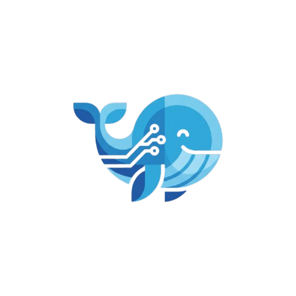

<p align="center">
  
</p>

<h1 align="center">AInux</h1>

<p align="center">
  <strong>The AI-Native Operating System</strong><br/>
  A bootable Linux distro where an AI agent <em>is</em> the entire user interface.
</p>

<p align="center">
  
  
  
  
</p>

---

## What is AInux?

AInux is a custom Linux distribution that replaces the traditional desktop with an **AI-powered agentic interface**. There is no file manager, no taskbar, no app launcher — just you and an AI that can control the entire operating system.

Under the hood, AInux combines:

| Component | Technology |
|-----------|------------|
| **AI Brain** | [OpenWhale](https://github.com/viralcode/openwhale) — multi-agent AI platform |
| **Desktop Shell** | WhaleOS — custom Qt6 QML native desktop |
| **Wayland Compositor** | Cage (kiosk compositor) |
| **Linux Base** | Buildroot (x86_64) / Debian Bookworm (ARM64) |
| **Init System** | systemd |
| **Audio** | PipeWire + WirePlumber |
| **Graphics** | Mesa (OpenGL/Vulkan) → DRM/KMS → Wayland |
| **Runtime** | Node.js 22.x, Python 3, SQLite |

---

## Table of Contents

- [Quick Start (macOS — Recommended)](#quick-start-macos)
- [Quick Start (Linux x86_64)](#quick-start-linux-x86_64)
- [Building from Source (Full ISO)](#building-from-source)
- [Running in QEMU](#running-in-qemu)
- [iOS / Remote Access](#ios--remote-access)
- [Project Structure](#project-structure)
- [WhaleOS Desktop Shell](#whaleos-desktop-shell)
- [System Administration](#system-administration)
- [Updating AInux](#updating-ainux)
- [Troubleshooting](#troubleshooting)
- [Contributing](#contributing)
- [License](#license)

---

## Quick Start (macOS)

> **Best for:** Apple Silicon Macs (M1/M2/M3/M4). Uses HVF hardware acceleration. ~5 min setup.

### Prerequisites

1. **Install QEMU** (with EFI firmware):
   ```bash
   brew install qemu
   ```

2. **Verify the UEFI firmware exists:**
   ```bash
   ls /opt/homebrew/share/qemu/edk2-aarch64-code.fd
   ```

3. **Download the Debian ARM64 cloud image:**
   ```bash
   curl -L -o vm/debian-generic.qcow2 \
     "https://cloud.debian.org/images/cloud/bookworm/latest/debian-12-generic-arm64.qcow2"
   ```

### Launch

```bash
python3 vm/launch-ainux.py
```

That's it. The script will:

1. Create a cloud-init seed image with all AInux configuration
2. Copy the base Debian image and resize it to 20GB
3. Boot QEMU with HVF acceleration (native speed)
4. Cloud-init auto-installs everything on first boot (~3–5 min):
   - Node.js 22.x + npm + pnpm
   - OpenWhale AI platform (cloned from GitHub)
   - Qt6 QML + Cage Wayland compositor
   - WhaleOS native desktop shell (compiled from `packages/whaleos/`)
   - systemd services for auto-start
5. Auto-reboots into the WhaleOS GUI

### After First Boot

| Service | Access |
|---------|--------|
| **WhaleOS Desktop** | Visible in the QEMU window |
| **OpenWhale API** | [http://localhost:7777](http://localhost:7777) |
| **OpenWhale Dashboard** | [http://localhost:7777/dashboard](http://localhost:7777/dashboard) |
| **SSH** | `ssh ainux@localhost -p 2222` (password: `ainux`) |

### Subsequent Boots

After the first boot, just re-run the same command. Cloud-init won't re-execute — it boots straight into the desktop:

```bash
python3 vm/launch-ainux.py
```

---

## Quick Start (Linux x86_64)

> **Best for:** Running AInux on a Linux host with KVM acceleration.

### Prerequisites

```bash
# Ubuntu/Debian
sudo apt install qemu-system-x86 qemu-utils

# Fedora
sudo dnf install qemu-system-x86 qemu-img

# Arch
sudo pacman -S qemu-full
```

### Build the ISO & Run

```bash
# Build the full ISO from source (see "Building from Source" below)
./scripts/build-iso.sh

# Boot in QEMU
./scripts/run-qemu.sh
```

### QEMU Options

```bash
./scripts/run-qemu.sh              # Default: GTK window with GL
./scripts/run-qemu.sh --no-kvm     # Disable KVM (slower, software emulation)
./scripts/run-qemu.sh --vnc        # VNC display on :0 (for headless servers)
./scripts/run-qemu.sh --headless   # No display, runs as daemon
```

**VM Specs:**
- **RAM:** 8 GB
- **CPUs:** 4
- **Disk:** 20 GB (qcow2, auto-created)
- **Port Forwards:** `localhost:7777` → OpenWhale, `localhost:2222` → SSH

---

## Building from Source

> **Full from-scratch build.** Compiles the Linux kernel, rootfs, Chromium, and OpenWhale into a bootable ISO. Requires a **Linux x86_64** host.

### System Requirements

| Requirement | Minimum |
|-------------|---------|
| **OS** | Ubuntu 22.04+ (or any modern Linux x86_64) |
| **RAM** | 16 GB |
| **Disk** | 150 GB free |
| **CPU** | Multi-core recommended (build uses all cores) |
| **Time** | ~2 hrs without Chromium, ~8 hrs with Chromium |

### Build Dependencies

```bash
sudo apt install build-essential git python3 wget curl xz-utils \
  gcc g++ make tar patch pkg-config
```

### Build Commands

```bash
# Full build (with Chromium from source — takes 6–8 hours)
./scripts/build-iso.sh

# Skip Chromium (uses system Chromium — much faster)
./scripts/build-iso.sh --skip-chromium

# Clean build (removes all build artifacts first)
./scripts/build-iso.sh --clean
```

### What the Build Does

1. **Clones Buildroot** (v2024.11) into `build/buildroot/`
2. **Applies AInux defconfig** — custom kernel, systemd, Wayland, Mesa, PipeWire, Node.js, Python, etc.
3. **Builds Chromium** (optional) — with Wayland/Ozone, VA-API hardware decode, PipeWire audio
4. **Compiles the Linux kernel** and root filesystem
5. **Integrates Chromium** into the rootfs at `/opt/ainux/chromium/`
6. **Generates a bootable ISO** → `ainux.iso`

### Output

```
ainux.iso          — Bootable ISO (flash to USB or boot in QEMU)
build/output/      — Full Buildroot output tree
```

### Flash to USB Drive

```bash
sudo dd if=ainux.iso of=/dev/sdX bs=4M status=progress
sync
```

> ⚠️ **Replace `/dev/sdX`** with your actual USB device. Double-check with `lsblk` — this will erase the drive.

---

## Running in QEMU

### macOS (Apple Silicon — ARM64)

The `launch-ainux.py` script handles everything automatically:

```bash
python3 vm/launch-ainux.py
```

**QEMU configuration used:**
- Machine: `virt` with HVF acceleration
- CPU: `host` (native Apple Silicon)
- RAM: 4 GB, 4 cores
- Display: `cocoa` (native macOS window)
- Devices: virtio-gpu, virtio-keyboard, usb-tablet, virtio-net, virtio-rng
- UEFI: EDK2 ARM64 firmware (`edk2-aarch64-code.fd`)
- Networking: user-mode with port forwarding

**Port Forwards:**

| Host Port | Guest Port | Service |
|-----------|------------|---------|
| 7777 | 7777 | OpenWhale API/Dashboard |
| 2222 | 22 | SSH |
| 9222 | 9222 | Chrome DevTools Protocol |

### Linux (x86_64)

```bash
# From a built ISO
./scripts/run-qemu.sh

# Or manually
qemu-system-x86_64 \
  -enable-kvm -cpu host \
  -m 8G -smp 4 \
  -drive file=ainux.iso,format=raw,media=cdrom,readonly=on \
  -drive file=build/ainux-disk.qcow2,format=qcow2 \
  -boot d \
  -device virtio-vga-gl \
  -display gtk,gl=on \
  -device virtio-net,netdev=net0 \
  -netdev user,id=net0,hostfwd=tcp::7777-:7777,hostfwd=tcp::2222-:22 \
  -device intel-hda -device hda-duplex \
  -usb -device usb-tablet
```

### Alternative: Alpine Linux Base (Manual)

For a lighter-weight VM, you can use the Alpine-based path:

```bash
# 1. Download Alpine ISO
curl -O https://dl-cdn.alpinelinux.org/alpine/v3.20/releases/aarch64/alpine-virt-3.20.0-aarch64.iso
mv alpine-virt-3.20.0-aarch64.iso vm/alpine.iso

# 2. Create disk and boot installer
qemu-img create -f qcow2 vm/ainux-disk.qcow2 20G
./vm/boot-ainux.sh --install

# 3. Inside the VM, install Alpine:
#    Run setup-alpine (use 'sys' disk mode, select vda)
#    Then run the AInux setup:
#    wget -O- http://10.0.2.2:8888/setup.sh | sh

# 4. Reboot into AInux
./vm/boot-ainux.sh
```

---

## iOS / Remote Access

Since AInux exposes OpenWhale on port `7777`, you can access the AI interface from any device on the same network, including an iPhone or iPad.

### From Your Local Network

1. Find the host machine's IP:
   ```bash
   # macOS
   ipconfig getifaddr en0

   # Linux
   hostname -I | awk '{print $1}'
   ```

2. Navigate to `http://<host-ip>:7777/dashboard` on your iPhone/iPad/any browser.

### Over SSH (iOS Terminal Apps)

Using apps like **Termius**, **Blink Shell**, or **a]SSH** on iOS:

```bash
ssh ainux@<host-ip> -p 2222
# Password: ainux
```

### Expose Over the Internet (Advanced)

To access AInux from anywhere:

```bash
# Option 1: SSH tunnel (requires a server with a public IP)
ssh -R 80:localhost:7777 serveo.net

# Option 2: Cloudflare Tunnel
cloudflared tunnel --url http://localhost:7777

# Option 3: ngrok
ngrok http 7777
```

> ⚠️ **Security:** Change the default password before exposing to the internet: `passwd ainux`

---

## Project Structure

```
ainux/
├── configs/
│   ├── ainux_defconfig         # Buildroot configuration (x86_64)
│   └── kernel.config           # Custom Linux kernel config
├── buildroot-external/
│   ├── Config.in               # Buildroot external config
│   ├── external.desc           # External tree descriptor
│   ├── external.mk             # External makefiles
│   └── package/                # Custom Buildroot packages
├── packages/
│   ├── core/                   # AInux core kernel (Node.js)
│   ├── gui/                    # Web-based GUI components
│   ├── chromium/               # Chromium patches for AInux
│   ├── openwhale/              # OpenWhale integration & extensions
│   └── whaleos/                # Qt6 QML native desktop shell
│       ├── main.cpp            # Application entry point
│       ├── main.qml            # Root QML component
│       ├── Desktop.qml         # Desktop environment
│       ├── TopBar.qml          # System status bar
│       ├── AppDock.qml         # Application dock
│       ├── ChatBar.qml         # AI chat interface
│       ├── LoginScreen.qml     # Login screen
│       ├── TerminalApp.qml     # Built-in terminal
│       ├── SettingsApp.qml     # System settings
│       ├── AgentsApp.qml       # AI agents manager
│       ├── SkillsApp.qml       # Skills manager
│       ├── ProvidersApp.qml    # AI provider config
│       ├── McpApp.qml          # MCP server manager
│       ├── AppsApp.qml         # App launcher
│       ├── AppWindow.qml       # Window container
│       ├── api.js              # API client helpers
│       └── whaleos-helper.mjs  # Node.js helper service
├── scripts/
│   ├── build-iso.sh            # Master build script
│   ├── run-qemu.sh             # QEMU launcher (x86_64)
│   ├── integrate-openwhale.sh  # Deep integration installer
│   ├── ainux-update.sh         # Update manager
│   ├── post-build.sh           # Buildroot post-build hook
│   └── post-image.sh           # Buildroot post-image hook
├── vm/
│   ├── launch-ainux.py         # One-command launcher (macOS ARM64)
│   ├── boot-ainux.sh           # Boot script (ARM64 + HVF)
│   ├── auto-setup.sh           # Fully automated Alpine setup
│   ├── setup.sh                # Manual Alpine setup script
│   ├── patch-openwhale.py      # OpenWhale login page patcher
│   └── qemu-type.py            # QEMU monitor keystroke helper
├── rootfs-overlay/
│   └── etc/                    # System config overlays
├── package.json                # Workspace root
└── README.md                   # ← You are here
```

---

## WhaleOS Desktop Shell

WhaleOS is the native desktop environment, built with **Qt6 QML** and running on the **Cage** Wayland compositor. It provides a modern, translucent desktop experience with:

| App | Description |
|-----|-------------|
| **ChatBar** | AI conversation interface (the primary interaction method) |
| **Terminal** | Built-in terminal emulator |
| **Settings** | System configuration (users, channels, display, network) |
| **Agents** | Manage AI agents and their configurations |
| **Skills** | Browse and manage OpenWhale skills |
| **Providers** | Configure AI provider API keys (OpenAI, Anthropic, etc.) |
| **MCP** | Model Context Protocol server management |
| **Apps** | Application launcher for generated apps |

### Desktop Architecture

```
┌─────────────────────────────────────────┐
│                 TopBar                  │  ← Clock, system status, icons
├─────────────────────────────────────────┤
│                                         │
│              Desktop.qml                │  ← Main workspace area
│                                         │
│     ┌───────────────────────────┐       │
│     │       App Windows         │       │  ← Floating app windows
│     │    (AppWindow.qml)        │       │
│     └───────────────────────────┘       │
│                                         │
│  ┌──────────────────────────────────┐   │
│  │           ChatBar.qml            │   │  ← AI chat bar (always visible)
│  └──────────────────────────────────┘   │
├─────────────────────────────────────────┤
│               AppDock                   │  ← App launcher dock
└─────────────────────────────────────────┘
```

### Compiling WhaleOS Manually

```bash
cd packages/whaleos
g++ -o whaleos main.cpp \
  $(pkg-config --cflags --libs Qt6Quick Qt6Qml Qt6Core Qt6Gui) -fPIC
```

**Qt6 Dependencies (Debian/Ubuntu):**
```bash
sudo apt install qt6-base-dev qt6-declarative-dev \
  qml6-module-qtquick qml6-module-qtquick-controls \
  qml6-module-qtquick-layouts qml6-module-qtquick-window \
  qt6-wayland libqt6opengl6-dev
```

---

## System Administration

### Default Credentials

| User | Password | Notes |
|------|----------|-------|
| `ainux` | `ainux` | Primary user, has sudo |
| `root` | `ainux` | Root access |

> 🔒 **Change the default passwords** after first login: `passwd ainux && sudo passwd root`

### systemd Services

| Service | Description | Commands |
|---------|-------------|----------|
| `openwhale` | OpenWhale AI Platform | `sudo systemctl {start\|stop\|restart\|status} openwhale` |
| `ainux-gui` | WhaleOS Desktop (Cage + QML) | `sudo systemctl {start\|stop\|restart\|status} ainux-gui` |

### Viewing Logs

```bash
# OpenWhale logs
journalctl -u openwhale -f

# GUI logs
journalctl -u ainux-gui -f

# All AInux logs
journalctl -u openwhale -u ainux-gui -f

# Setup completion check
cat /var/log/ainux-setup.log
```

### OpenWhale Configuration

The OpenWhale `.env` file is located at `/opt/ainux/openwhale/.env`:

```env
PORT=7777
NODE_ENV=production
AINUX_MODE=true
AINUX_VERSION=0.1.0
```

### AI System Tools

AInux exposes 8 system tools to the AI agent:

| Tool | Capability |
|------|------------|
| `ainux_hardware_info` | CPU, GPU, RAM, storage, temps |
| `ainux_process_control` | Start/stop/restart systemd services |
| `ainux_network_control` | WiFi scan/connect, Bluetooth, DNS |
| `ainux_audio_control` | Volume, mute, device switching |
| `ainux_display_control` | Resolution, brightness |
| `ainux_power` | Shutdown, reboot, suspend |
| `ainux_update` | Update OpenWhale/AInux from GitHub |
| `ainux_system_config` | Read/write system configuration |

---

## Updating AInux

AInux includes a built-in update manager:

```bash
# Check for available updates
ainux-update check

# Update OpenWhale only
ainux-update openwhale

# Update AInux core
ainux-update ainux

# Update everything
ainux-update all

# Roll back to previous version
ainux-update rollback openwhale
```

The update manager:
- Backs up the current Git SHA before updating
- Preserves your database, memory, skills, and configuration
- Supports one-step rollback to the previous version
- Auto-reinstalls npm dependencies after updates

---

## Troubleshooting

### QEMU Won't Start (macOS)

**Symptom:** `qemu-system-aarch64: failed to initialize HVF`

```bash
# Ensure QEMU is installed via Homebrew
brew reinstall qemu

# Verify firmware file exists
ls /opt/homebrew/share/qemu/edk2-aarch64-code.fd
```

### Cloud-Init Stalls / No Network

**Symptom:** First boot hangs at "Waiting for network"

```bash
# SSH in and check cloud-init status
ssh ainux@localhost -p 2222
sudo cloud-init status --long
sudo cat /var/log/cloud-init-output.log
```

### WhaleOS Black Screen

**Symptom:** QEMU window shows nothing after boot

```bash
# SSH in and check services
ssh ainux@localhost -p 2222
sudo systemctl status ainux-gui
sudo systemctl status openwhale
journalctl -u ainux-gui --no-pager -n 50

# Restart the GUI
sudo systemctl restart openwhale
sleep 5
sudo systemctl restart ainux-gui
```

### OpenWhale Not Starting

```bash
# Check the logs
journalctl -u openwhale -n 50

# Try manual start
cd /opt/ainux/openwhale
node openwhale.mjs

# Rebuild native modules if needed
npm rebuild better-sqlite3
```

### Port Already in Use

```bash
# Check what's using port 7777
lsof -i :7777

# Kill conflicting process
kill $(lsof -t -i :7777)
```

### No Audio in VM

```bash
# Check PipeWire status
systemctl --user status pipewire wireplumber

# Restart audio stack
systemctl --user restart pipewire wireplumber
```

### Re-Running Cloud-Init (Reset First Boot)

```bash
sudo cloud-init clean
sudo reboot
```

---

## Architecture Overview

```
┌──────────────────────────────────────────────────────────┐
│                     USER (Browser / iOS / Desktop)        │
│                    http://localhost:7777/dashboard         │
└────────────────────────────┬─────────────────────────────┘
                             │
┌────────────────────────────▼─────────────────────────────┐
│                  WhaleOS (Qt6 QML Desktop)                │
│              Cage Wayland Compositor (kiosk)              │
├──────────────────────────────────────────────────────────┤
│                 OpenWhale AI Platform                     │
│         ┌──────────┬──────────┬──────────────┐           │
│         │  Agents  │  Skills  │  Extensions  │           │
│         └──────────┴──────────┴──────────────┘           │
│         ┌──────────┬──────────┬──────────────┐           │
│         │ Memory   │ Sessions │  Dashboard   │           │
│         └──────────┴──────────┴──────────────┘           │
├──────────────────────────────────────────────────────────┤
│                   Node.js 22.x Runtime                   │
│                   SQLite · better-sqlite3                 │
├──────────────────────────────────────────────────────────┤
│                     systemd (init)                        │
│              openwhale.service + ainux-gui.service        │
├──────────────────────────────────────────────────────────┤
│               Linux Kernel (6.x LTS)                     │
│         DRM/KMS · Mesa · PipeWire · virtio               │
├──────────────────────────────────────────────────────────┤
│      QEMU (HVF on macOS / KVM on Linux) or Bare Metal   │
└──────────────────────────────────────────────────────────┘
```

---

## Contributing

1. **Fork** the repository
2. **Create a branch:** `git checkout -b feature/my-feature`
3. **Commit:** `git commit -m "Add my feature"`
4. **Push:** `git push origin feature/my-feature`
5. **Open a Pull Request**

### Development Workflow

```bash
# Run the core kernel in dev mode
npm run dev

# Build WhaleOS GUI
npm run build:gui

# Lint
npm run lint

# Test in QEMU
npm run test:qemu
```

---

## License

MIT — see [LICENSE](LICENSE) for details.

---

<p align="center">
  <strong>🐋 AInux v0.1.0</strong><br/>
  Built by <a href="https://github.com/viralcode">Jijo John</a><br/>
  Powered by <a href="https://github.com/viralcode/openwhale">OpenWhale</a>
</p>
