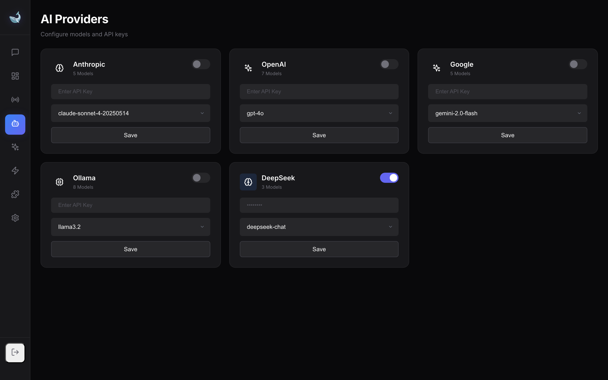
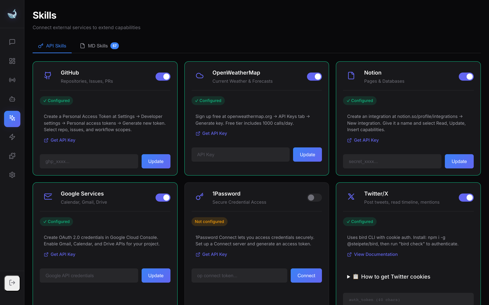

<p align="center">
  
</p>

<h1 align="center">OpenWhale</h1>

<p align="center">
  <strong>The AI that doesn't just talk. It works. 🐋</strong>
</p>

<p align="center">
  Deploys agent swarms, clears your inbox, sends emails, manages your calendar, browses the web, writes code, and runs your life.<br/>
  All from WhatsApp, Telegram, Discord, or any chat app you already use.
</p>

<p align="center">
  <strong>🤖 Multi-Agent Swarms</strong> — Fan-out tasks to parallel agents with shared memory — not one bot, an army<br/>
  <strong>🧠 Self-Extensible</strong> — Creates its own tools, skills, and automations on the fly<br/>
  <strong>🔒 Runs on Your Machine</strong> — Your data never leaves your computer. Private by default<br/>
  <strong>🌐 Website</strong> — <a href="https://viralcode.github.io/openwhale">viralcode.github.io/openwhale</a><br/>
  <strong>☁️ Managed Hosting</strong> — Coming soon
</p>

---

## What is OpenWhale?

Other AI assistants chat. OpenWhale **does**. It deploys autonomous agent swarms that fan-out complex work to multiple AI agents running in parallel, coordinate them with shared memory and file locks, and collect results automatically. Connect it to 8 AI providers, let it talk on your behalf through WhatsApp/Telegram/Discord/Twitter/iMessage, browse the web with real browser automation, execute code, manage your calendar, send emails — and basically run your digital life.

**An AI workforce, not just an AI assistant.** One agent is nice. A coordinated swarm is unstoppable.

<p align="center">
  
</p>

---

## ⚡ Quick Start

```bash
git clone https://github.com/viralcode/openwhale.git
cd openwhale
pnpm install
pnpm approve-builds
pnpm run dev
```

Open **http://localhost:7777/dashboard** → add your API keys → start chatting.

> 📖 **[Full Getting Started Guide →](docs/getting-started.md)**
>
> 🪟 **On Windows?** Run the one-line installer in PowerShell — installs everything automatically:
> ```powershell
> irm https://raw.githubusercontent.com/viralcode/openwhale/main/install.ps1 | iex
> ```
> Or see the **[Windows Installation Guide →](docs/windows-setup.md)** for manual setup.

---

## ✨ Core Features

### 🤖 8 AI Providers

Switch between any major AI model on the fly. One assistant, unlimited model choices.

| Provider | Top Models |
|----------|------------|
| **Anthropic** | Opus 4.5, Sonnet 4.5 |
| **OpenAI** | GPT-5.2, GPT-5, GPT-4o, o4-mini |
| **Google Gemini** | Gemini 3 Pro, Gemini 2.5 Pro |
| **Qwen** | Qwen3-Max, QwQ-Plus, Qwen3-Coder |
| **DeepSeek** | DeepSeek Chat, Coder, Reasoner |
| **Groq** | Llama 3.3 70B, Mixtral 8x7B |
| **Together AI** | Any open-source model |
| **Ollama** | Local models — no API key! |

Automatic failover between providers. If one fails, the next takes over.

> 📖 **[Providers Documentation →](docs/providers.md)**

<p align="center">
  
</p>

---

### 🤖 Multi-Agent Coordination

Deploy **multiple AI agents in parallel** to tackle complex tasks faster. Automatic task decomposition, shared context, advisory file locks, and inter-agent messaging.

```
"Research quantum computing and write a Python sorting algorithm"
     → Orchestrator fans out to Research Agent + Coder Agent
     → Results synthesized automatically
```

- **Fan-out / Fan-in** — Split work across specialized parallel agents
- **Shared Context** — Agents share data via a namespaced key-value store
- **Active Locks** — Advisory file locks prevent concurrent write conflicts
- **Inter-Agent Messaging** — Agents can talk to each other during execution
- **A2A Protocol** — Google Agent2Agent protocol for interop with LangGraph, CrewAI, AutoGen

> 📖 **[Multi-Agent Documentation →](docs/multi-agent.md)**

---

### 💬 6 Messaging Channels

Your AI responds across all platforms — unified inbox, one brain.

| Channel | How It Works |
|---------|--------------|
| **WhatsApp** | Scan QR code, uses your personal account |
| **Telegram** | Create a bot with @BotFather |
| **Discord** | Add bot to your server |
| **Slack** | Slack app integration |
| **Twitter/X** | Auto-reply to mentions via bird CLI (cookie auth, no API!) |
| **iMessage** | macOS native — read and send iMessages |

> 📖 **[Channels Setup Guide →](docs/channels.md)**

---

### 🛠️ 40+ Built-in Tools

The AI can actually DO things, not just talk about them.

| Category | Tools |
|----------|-------|
| **System** | Shell exec, code execution, system info, clipboard, Apple Shortcuts |
| **Files** | Read/write files, git, zip, codebase search, database queries |
| **Documents** | PDF creation, PowerPoint slides, Excel spreadsheets |
| **Web** | Browser automation (Playwright + BrowserOS), web fetch |
| **Media** | Screenshots, camera, canvas, image analysis, TTS, screen recording, QR codes |
| **Communication** | Email, iMessage, calendar events |
| **Infrastructure** | Docker, SSH |
| **Memory** | Persistent memory, knowledge graphs, multi-step planning |
| **Automation** | Cron scheduling, self-extensions, skill creator |
| **Coordination** | Agent listing, session management, shared context, file locks |

> 📖 **[Full Tools Reference →](docs/tools.md)**

<p align="center">
  
</p>

---

### 🔌 API Skills (External Integrations)

Connect to your favorite services — the AI handles the API calls.

| Skill | What It Does |
|-------|--------------|
| **GitHub** | Manage repos, issues, PRs, commits |
| **Notion** | Search, create, update pages and databases |
| **Google Calendar** | View and create events |
| **Gmail** | Read, send, and search emails |
| **Google Drive** | Upload, download, list files |
| **Google Tasks** | Manage your to-do lists |
| **Weather** | Current conditions and forecasts |
| **1Password** | Securely fetch passwords and secrets |
| **Apple Notes/Reminders** | Native macOS integration |
| **Twitter/X** | Post, search, timeline, mentions, follow |
| **Spotify** | Playback control, search, playlists |
| **Trello** | Boards, lists, and cards |
| **ElevenLabs** | AI text-to-speech |
| **Twilio** | SMS and voice calls |

Plus **50+ Markdown Skills** from the [OpenClaw](https://github.com/VoltAgent/awesome-openclaw-skills) community.

> 📖 **[Skills Documentation →](docs/skills.md)**

<p align="center">
  
</p>

---

### 🌐 Browser Automation

Two backends to choose from:

| Backend | Best For |
|---------|----------|
| **Playwright** | Simple scraping, headless automation, zero setup |
| **BrowserOS** | Real browser with your extensions, cookies, and logins |

BrowserOS lets the AI control YOUR actual browser — including logged-in sessions, AdBlock, 1Password, and everything else.

> 📖 **[Browser Automation Guide →](docs/browser-automation.md)**

---

### ⚡ Self-Extension System

The AI can create its own automations. Just ask.

- *"Create an extension that checks Bitcoin price every hour and sends it to WhatsApp"*
- *"Make an extension that reminds me to drink water"*
- *"Create a daily standup summary extension"*

Extensions support cron scheduling, multi-channel output, and persist across restarts.

> 📖 **[Extensions Documentation →](docs/extensions.md)**

<p align="center">
  
</p>

---

### 🧠 Persistent Memory

Remembers everything, even after restarts: long-term facts, daily notes, vector search (local embeddings, no API needed!), and session persistence.

> 📖 **[Memory System →](docs/memory.md)**

---

### 💓 Heartbeat (Proactive Agent)

The AI wakes up periodically to check on things — configurations, inboxes, tasks — without you having to ask.

> 📖 **[Heartbeat Documentation →](docs/heartbeat.md)**

---

### 🔒 Enterprise Security

JWT authentication, rate limiting, audit logs, sandboxed code execution, command filtering, multi-user support.

> 📖 **[Security Documentation →](docs/security.md)**

---

### 🐋 macOS Native App

Native SwiftUI menu bar app with quick chat, status monitoring, and channel controls — no browser needed.

> 📖 **[macOS App Documentation →](docs/macos-app.md)**

---

## Why OpenWhale?

| Feature | OpenWhale | ChatGPT | Claude | Typical Chatbot |
|---------|-----------|---------|--------|-----------------|
| **Multi-agent orchestration** | ✅ Fan-out/fan-in with shared memory | ❌ No | ❌ No | ❌ No |
| **Multi-model support** | ✅ 8 providers | ❌ GPT only | ❌ Claude only | ❌ Single model |
| **Run shell commands** | ✅ Full access | ❌ No | ❌ No | ❌ No |
| **Browser automation** | ✅ Playwright + BrowserOS | ❌ Limited | ✅ Limited | ❌ No |
| **WhatsApp/Telegram/Discord** | ✅ All channels | ❌ No | ❌ No | ❌ Maybe one |
| **iMessage (macOS)** | ✅ Native | ❌ No | ❌ No | ❌ No |
| **Twitter integration** | ✅ Full API | ❌ No | ❌ No | ❌ No |
| **Self-extensible** | ✅ Creates own tools | ❌ No | ❌ No | ❌ No |
| **Runs locally** | ✅ Your machine | ❌ Cloud only | ❌ Cloud only | ❌ Usually cloud |
| **Open source** | ✅ MIT license | ❌ Closed | ❌ Closed | ❌ Varies |
| **Persistent memory** | ✅ Vector search | ✅ Limited | ✅ Limited | ❌ Usually no |
| **Proactive heartbeat** | ✅ Configurable | ❌ No | ❌ No | ❌ No |

---

## 📚 Documentation

| Document | Description |
|----------|-------------|
| **[Getting Started](docs/getting-started.md)** | Installation, prerequisites, quick start, Docker |
| **[Providers](docs/providers.md)** | AI providers, models, failover configuration |
| **[Multi-Agent](docs/multi-agent.md)** | Fan-out/fan-in, shared context, A2A protocol |
| **[Channels](docs/channels.md)** | WhatsApp, Telegram, Discord, Slack, Twitter, iMessage |
| **[Tools](docs/tools.md)** | Complete reference for all 40+ built-in tools |
| **[Skills](docs/skills.md)** | API skills and Markdown community skills |
| **[Browser Automation](docs/browser-automation.md)** | Playwright vs BrowserOS |
| **[Memory](docs/memory.md)** | Long-term memory, vector search, session persistence |
| **[Heartbeat](docs/heartbeat.md)** | Proactive agent configuration |
| **[Extensions](docs/extensions.md)** | Self-extension system and scheduling |
| **[Dashboard](docs/dashboard.md)** | Web dashboard and setup wizard |
| **[macOS App](docs/macos-app.md)** | Native menu bar app |
| **[API](docs/api.md)** | REST API reference and OpenAI-compatible endpoints |
| **[Security](docs/security.md)** | Authentication, rate limiting, audit, sandboxing |
| **[Windows Setup](docs/windows-setup.md)** | Installing & running on Windows 10/11 |
| **[Configuration](docs/configuration.md)** | Full .env reference |
| **[CLI](docs/cli.md)** | CLI commands and npm scripts |
| **[Troubleshooting](docs/troubleshooting.md)** | Common issues and fixes |

---

## Project Structure

```
src/
├── agents/      # Multi-agent orchestration, inter-agent comms, A2A protocol
├── auth/        # JWT, API keys, sessions
├── channels/    # WhatsApp, Telegram, Discord, Slack, Twitter, iMessage adapters
├── cli.ts       # Interactive terminal interface
├── daemon/      # Background service (launchd on macOS)
├── dashboard/   # Web admin panel + coordination dashboard
├── db/          # SQLite/PostgreSQL with Drizzle ORM
├── gateway/     # Hono-based HTTP API routes
├── heartbeat/   # Proactive agent scheduler
├── integrations/# Google APIs (Calendar, Gmail, Drive, Tasks)
├── memory/      # Persistent memory, embeddings, vector search
├── providers/   # Anthropic, OpenAI, Google, Groq, Qwen, DeepSeek, Together, Ollama
├── security/    # Rate limiting, audit logs, sandboxing, command filtering
├── sessions/    # Persistent conversations, fan-out auto-detection, compaction
├── skills/      # GitHub, Notion, Spotify, Weather, Apple, Twitter, etc.
├── tools/       # 40+ tools — files, browser, code exec, screenshots, coordination
└── voice/       # Voice interaction support
```

---

## Contributing

PRs welcome! If you find a bug or have an idea, open an issue. Keep it friendly.

## License

MIT — do whatever you want with it.

---

<p align="center">
  Built with ❤️ by <a href="https://jijojohn.me">Jijo John</a>
</p>
